# Chat App on Indian History (AI Capstone Project)

`I got my motivation from "Build A Large Language from Scratch" by professor Sebastian Raschka. The project is a chat app that allows users to ask questions about Indian history and receive answers based on a large language model (LLM) trained on a dataset of Indian history, including the title for the conversation.`

This project presents a full-stack chatbot application focused on Indian history, enabling engaging interactions through a custom React Native interface. At its core, it leverages a GPT-2 model implemented from scratch in PyTorch, finetuned with LoRA weights on an Indian history dataset. To enhance the visual theme, Neural Style Transfer (NST) generates abstract images inspired by traditional Indian sculptures.

### ‼️ Note: The models implemented are GPT-2, and hence are not finetuned and capable of handling conversations. I did not finetune models on conversation dataset.

### ‼️ Note: This project uses hydra to manage experimenets. This is same for both chathist and sculpgen subfolders. Please refer to config folder under each subfolder for more details.

#### Example Conversation:

<div align="center">
  
</div>

## Features

✅ Indian History Chatbot – Answer queries about Indian history using a finetuned GPT-2 model.
✅ Chat Title Generator – Automatically generates meaningful titles for each conversation.
✅ Neural Style Transfer – Produces abstract images blending Indian sculptures with abstract art.
✅ Full-stack App – Built with React Native frontend, Node.js server, and FastAPI model servers.
✅ Data Persistence – Stores chat history, titles, and images in MongoDB.

## Data Sources

- **Indian History Dataset**: [HuggingFace](https://huggingface.co/datasets/BashitAli/Indian_history)
- **Chat Title Dataset**: [HuggingFace](https://huggingface.co/datasets/ogrnz/chat-titles)
- **Indian Sculpture Images**: [HuggingFace](https://huggingface.co/datasets/Durgas/Indian_sculptures)
- **Abstract Art Images**: [Kaggle](https://www.kaggle.com/datasets/bryanb/abstract-art-gallery)
- **Other Sources for images**: [Pixels](https://www.pexels.com/search/pattern/)

## Project Structure

The project is organized into several key components:

### 1. Chathist:

This subfolder contains code for pulling and training GPT-2 model from scratch using PyTorch. It also includes the LoRA finetuning process. The chathist module consists of the following components:

- **chathist/conf/train** - Hydra configuration for training both the models present in `.yaml` format.
- **tokenizer.py**: A wrapper around tiktoken tokenizer for tokenizing text as per GPT-2 requirements.
  -- Example usage:

```python
from chathist.tokenizer import Tokenizer

tokenizer = Tokenizer()
text = "Hello this is sameer?"
tokens = tokenizer.encode_text(text)
print(tokens)  # Output: tensor([15496,   428,   318,   976,   263], dtype=torch.int32)
decoded_text = tokenizer.decode_ids(tokens)
print(decoded_text)  # Output: "Hello this is sameer?"
```

- **instruction_styling.py**: Implements instruction styling for the model. As for the project, two prompt styles are used: `Alpaca` and `Phi-3`. It is important to highlight that the Alpaca prompt style is used for training the model on history dataset, while the Phi-3 prompt style is used chat title dataset.
  -- Example usage:

```python
from chathist import InstructionStyle

style = InstructionStyle.load()
style = InstructionStyle.load() # Output: style = InstructionStyle.load()
print(stype.format()) #<|user|>Hi, what is the meaning of AI<|llm|>
```

- **processing.py**: Containes functions for processing the dataset, including loading, cleaning, and preparing the data for training. It is wrapper for Dataset and DataLoader classes of PyTorch. Optionally, masking can be applied to the dataset. This is useful in making model start generating responses rather than continuing the input text.

- **model.py**: Contains the training and generating part of the project.
- **gpt_modules.py**: Contains the GPT-2 model implementation from scratch, including the architecture and forward pass. Also, it contains the LoRA implementation.
  --**notebooks**: Contains jupyter notebooks for training and testing the model. It is contains examples to follow along and reproduce the results. Please refer to the folder for more details.

- **To Train the model** - Refer notebooks/train folder that has jupyter notebooks for both chat_title and chat_history datasets.

- **server/chat_history.py & server/chat_title.py** - FastAPI server used to serve trained model in inference mode. Simple servers that returns reading stream as response.

Command to run the chat_history.py

```bash
uvicorn server.chat_history:app --reload --port 8000
```

Command to run the chat_title.py

```bash
uvicorn server.chat_title:app --reload --port 8001
```

### 2. Sculpgen

Second part of this project includes implementing Neural Style Transfer for mixing abstract images with Indian sculptures to match the overall theme of the project. The subfolder `sculpgen/` includes:

- **nst_model.py** - This file implements the structure of the NST model. It contains methods for loss calculation (content_loss, style_loss) and training the target image to learn the mixed pattern from random noise.
- **vgg_mode.py** - This file contains wrapper for VGG19 model used from pytorch and contains a forward method to extract intermediate vector representations used to create a nst image. (Note: The model is used in inference mode.)
- **notebooks/\*** - Please refer these jupyter notebooks for more details.
- **yaml/\*** - This implementation uses pyaml, rather than hydra - a change I made for my experimentation. -**Note** - All the images trained were served from s3 bucket and maintained using `dvc`. During presentation, I made access public, now I have deleted the s3 bucket altogether.

Examples of the implementation:

<table>
  <tr>
    <td>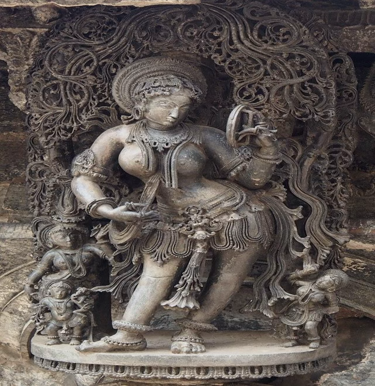
    <td>
    <td>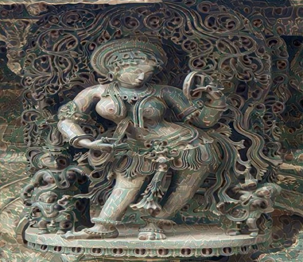
  </tr>
</table>

Other NST images generated:

<table>
  <tr>
    <td>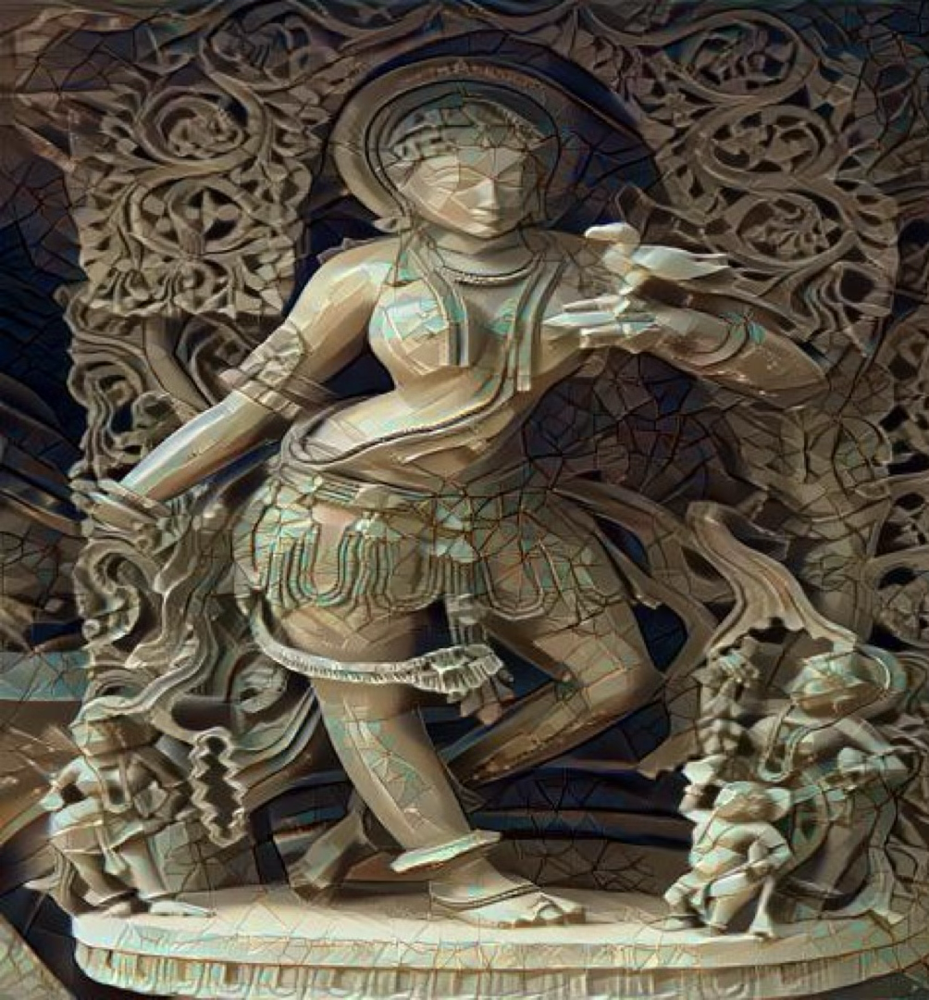
    <td>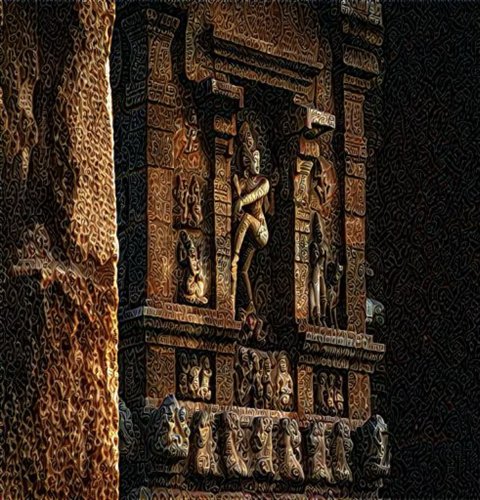
    <td>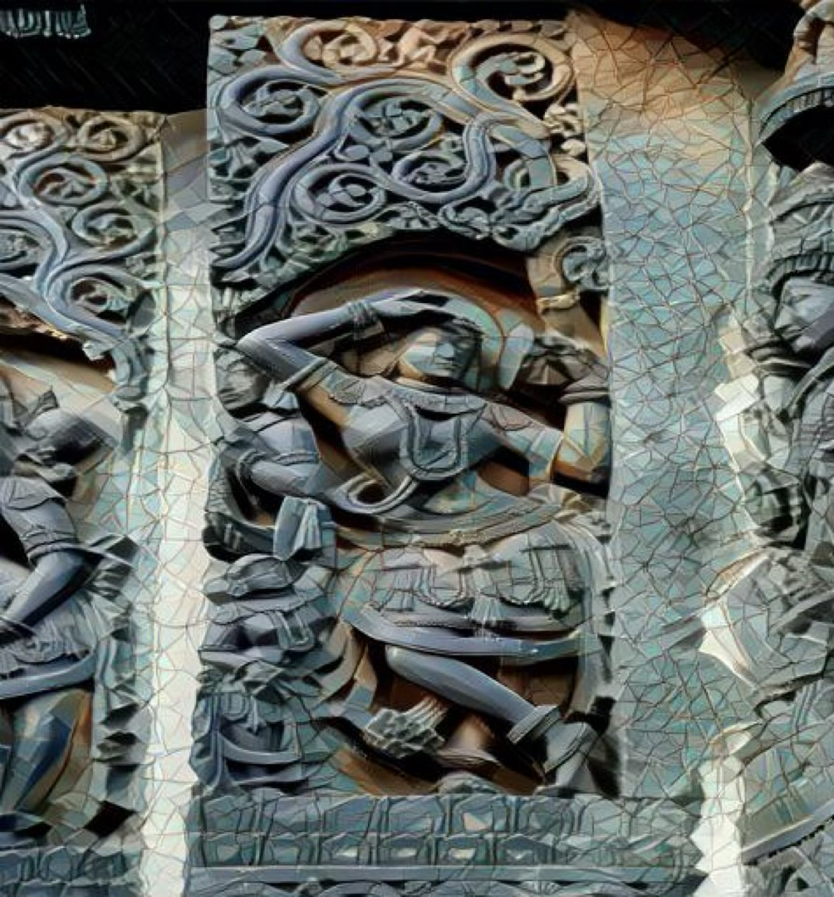
  </tr>
  <tr>
    <td>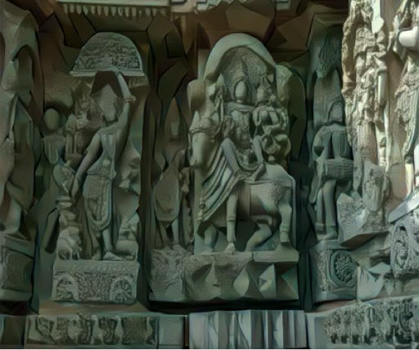
    <td>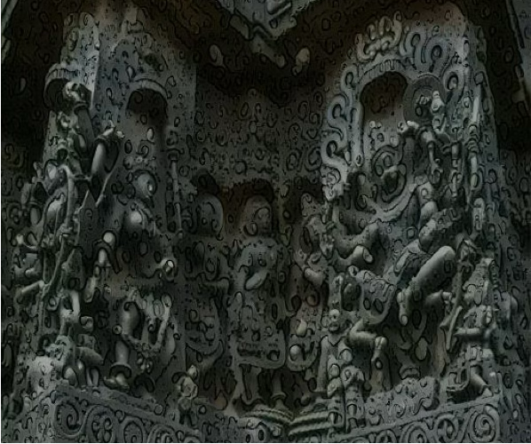
    <td>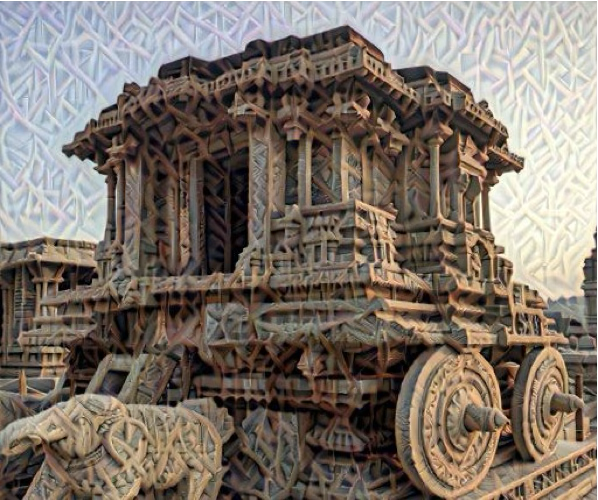
  </tr>
</table>

### Nodejs server:

To serve both the models finetuned separately, I implemented a Nodejs server that requests respective fastAPI servers for response. This server is also responsible to store conversations. I have used MongoDB as the primary database and managed it via MongoDB Atlas. I have used mongoose as the ODM(Object Data Modelling), having two collections. One is `Chats`, that stores details like chat_uuid, display image, createdAt to name a few. The other is the `Conversations` collection, that stores uuid(for chat identification), role('user', 'bot'), message and createdAt for better retrievel.

To start the server:

```bash
npm start
```

### 4. React Native Application:

This is a frontend app that I created to put together everything I worked on. Although, the UI is very simple(had to speed things up for my final presentation and report), I was able to create a simple design, with a homepage, chatpage and a explore page where I displayed nst images from s3 bucket.

To start the server (Follow the prompt that appears):

```bash
npm start
```

Example images:

<table>
  <tr>
    <td>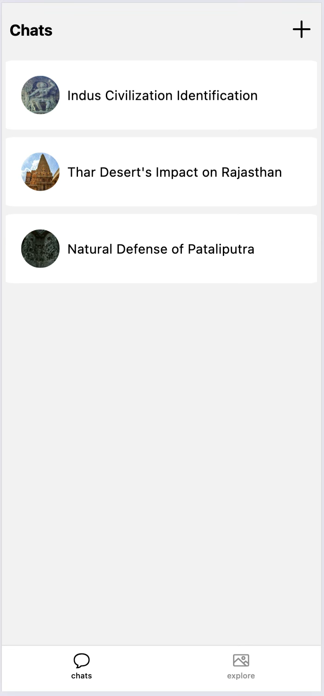</td>
    <td>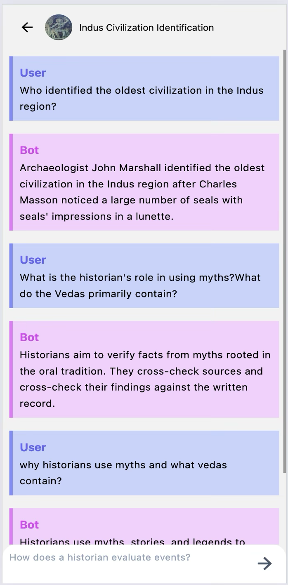</td>
    <td>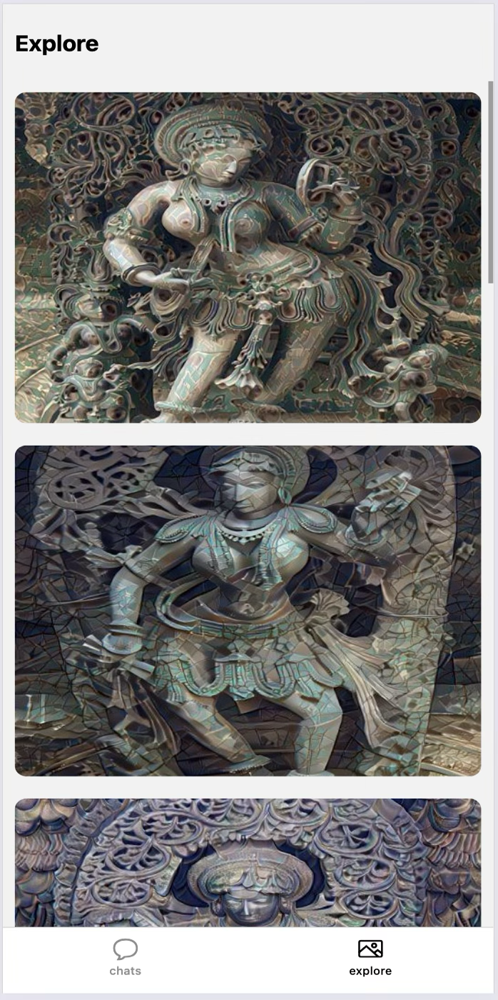</td>
  </tr>
</table>

### References (as per my final report):

- Alec Radford, Jeffrey Wu, and Rewon Child, “Language Models are Unsupervised Multitask Learners” .

- Edward J. Hu, Yelong Shen, Phillip Wallis, “LoRA: Low-Rank Adaptation of Large Language Models”.

- Leon A. Gatys, Alexander S. Ecker, Matthias Bethge, “A Neural Algorithm of Artistic Style”.

- Karen Simonyan, Andrew Zisserman, “Very Deep Convolutional Networks for Large-Scale Image Recognition”

- Aldo Ferlatti, “Neural Style Transfer (NST) — theory and implementation” [source](https://medium.com/@ferlatti.aldo/neural-style-transfer-nst-theory-and-implementation-c26728cf969d).

- Aman Arora, “The Annotated GPT-2" [source](https://amaarora.github.io/posts/2020-02-18-annotatedGPT2.html).

- Sebastian Raschka, “Build a Large Language Model (From Scratch)” [source](https://www.manning.com/books/build-a-large-language-model-from-scratch).
